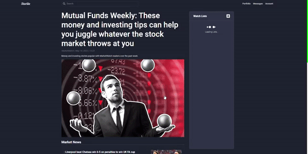

  
  
  
  
  

Currently Software Engineer at 100Devs and Operating Officer at Cinciao. I am motivated by the power of technology as a tool for positive change.

See [my website](https://hiluan.dev) for more information!

<h1 align="center">Projects</h1>
<table bordercolor="#66b2b2">
  
  <tr>
    <td width="50%" valign="top">
      <h3 align="center">Starlite: Online Trading Platform</h3>
         
        
         
        

    
  
      

        
<strong>React.js, Redux, Sass, Javascript, Node.js, & Express.js</strong> - Startlite, a WebApp with real-time market data, lets you follow your favorite stocks, create your own portfolio and test your trades and strategies.

    </td>
    <td width="50%" valign="top">
      <h3 align="center">Cinciao.vn: Platform As A Service</h3>
         
        
         
        

  
  
      

        
<strong>Shopify, HTML5, CSS3, & Javascript</strong> - Cinciao allows Vietnamese celebrities to send personalized video messages to their fans and to FaceTime directly with them, anytime and anywhere.

    </td>
  </tr>
  
  <tr>
    <td width="50%" valign="top">
      <h3 align="center">Waves: Lofi Chillhop Music Player</h3>
         
      
         
        

  
  
      

        
<strong>React.js, Sass, Javascript</strong> - Waves is a music player with a simple but elegant UI. With a library of Chillhop Music, you can play it whenever you need a chill moment in life.

    </td>
    <td width="50%" valign="top">
      <h3 align="center">iounica.com: Online Fashion Shop</h3>
       
        
       
        

  
  
      

        
<strong>Shopify, HTML5, CSS3, & Javascript</strong> - iounica, a B2C online shop integrated with Shopify, gives its German and European customers a chance to purchase the best Italian styles to date.

    </td>

  </tr>
  <tr >
    <td width="50%" valign="top">
      <h3 align="center">hiluan.dev: Luan's Portfolio</h3>
       
        
       
        

  
  
      

        
<strong>React.js, Redux, Sass, Javascript, Node.js, & Express.js</strong> - Portfolio Site including links to my projects and ways to get in contact with me.

    </td>
  </tr>

</table>

<!-- <h1 align="center">Technologies</h1>
<h3 align="center">Programming Languages</h3>

 

<h3 align="center">Frontend Development / Mobile App Development</h3>

 

 
 
 

<h3 align="center">Backend Development / Database / Devops / Backend as a Service(BaaS)</h3>

 
 
 

<h3 align="center"></h3>

 

<h3 align="center">AI/ML</h3>

 

<h3 align="center">Design Softwares</h3>

 
 

<h3 align="center">Other</h3>

   
 
 -->

<h3 align="center">Languages and Tools:</h3>

    
    
    
    
    
    
    
    
    
    
    
    
    
    

---

<h1 align="center">Connect</h1>

  
  
  
  
  

